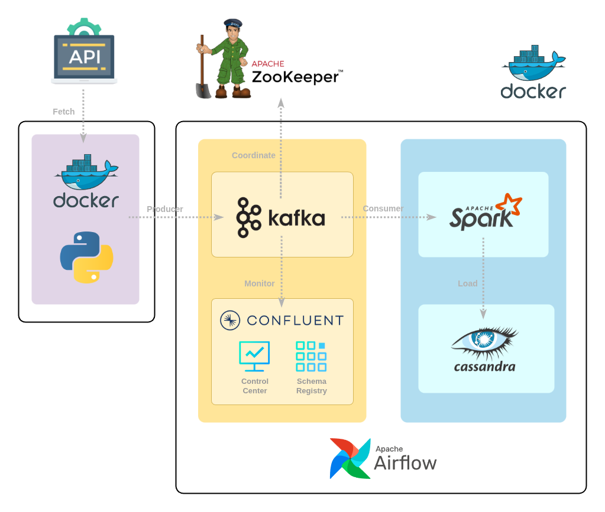
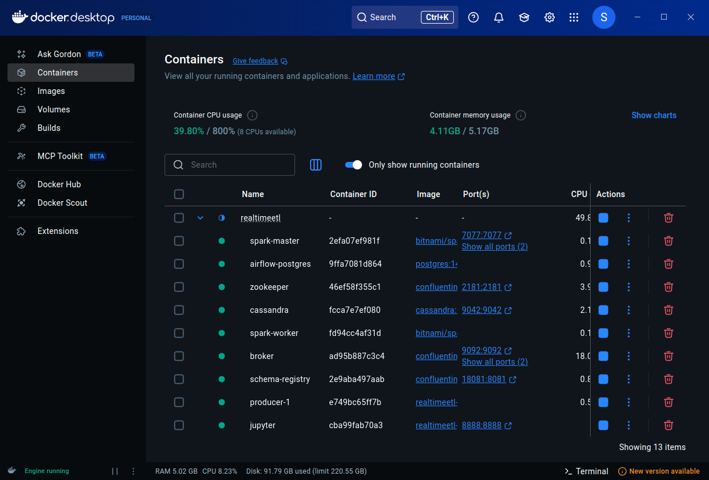
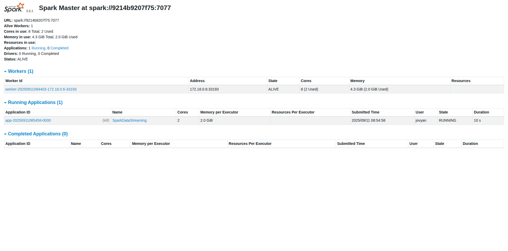

# 📡 Streaming Data Engineering Project

> Real-time data engineering project using Docker, Kafka, Spark Structured Streaming, Cassandra and Airflow

## 🧾 Project Overview

This project demonstrates a real-time data pipeline for streaming ingestion, processing, and storage.
It covers orchestration (Airflow), streaming processing (Spark Structured Streaming), real-time messaging (Kafka), scalable storage (Cassandra), and analytics (Jupyter).

## ⚙️ Architecture Diagram


## 💡 Technology Stack

**Programming Languages :**
- Python
- SQL

**Data Streaming & Orchestration :**
- Apache Kafka
- Apache Airflow
- Apache Spark (Structured Streaming)

**Infrastructure & Storage  :**
- Docker
- Cassandra

**Visualization :**
- Looker Studio
- JupyterLab

## 🐳 Docker / Infrastructure Setup



**Services included :**
- `zookeeper`, `broker`, `schema-registry`, `control-center`
- `airflow-webserver`, `airflow-scheduler`, `postgres`
- `spark-master`, `spark-worker`
- `cassandra_db`
- `jupyter`
- `producer`

## 💾 Real-time Storage (Cassandra)


**Key Features :**
- Uses **Cassandra** for scalable, fault-tolerant storage.
- Processed streaming data from Spark is written into Cassandra.
- Supports CQL queries for downstream analytics.

## ⚡ Spark Cluster (Master/Workers)



**This cluster runs in standalone mode with :**
- 1 Spark Master
- 1 Spark Workers
- Deployed inside Docker containers

## 📂 Data Ingestion

### 1. Kafka Producer
```json
{
  "id": "u123",
  "event_time": "2025-09-11T10:00:00Z",
  "action": "purchase",
  "amount": 59.99
}
```
- Custom producer generates real-time events.
- Data is published to Kafka topics, consumed by Spark.
- Kafka Control Center available at http://localhost:9021

## 🧾 Data Flow Diagram


## 🔄 Streaming ETL Workflow Diagram


#### Spark ETL Components / Airflow Tasks

1. **Ingestion Stage:**
   - `kafka_producer` → send events into Kafka topics

2. **Transform Stage:**
   - `spark_streaming` → read Kafka stream
   - apply transformations, filtering, parsing

3. **Load Stage:**
   - `cassandra_writer` → push processed data into Cassandra tables
  
4. **Orchestration:**
   - Airflow DAG schedules and monitors streaming jobs

## ✅ Final Output
[](https://lookerstudio.google.com/reporting/5737527d-e089-47f5-80f1-2adda4ff3019)
* The final output from Looker Studio can be accessed via the following link: [View Dashboard](https://lookerstudio.google.com/reporting/5737527d-e089-47f5-80f1-2adda4ff3019). Note: The dashboard reads data from a static CSV file exported from BigQuery.

## 🚀 Setup & Execution

1. Clone this repository :

```bash
git clone https://github.com/supakunz/Book-Revenue-Pipeline.git
```

2. Navigate to the project folder and Set up the environment variables :

```
cd Book-Revenue-Pipeline
```
- Create a `.env` file in the root directory.

- Add the following variables to the .env file, replacing the placeholder values with your own:

```
# Airflow Configuration
AIRFLOW_UID=1000
_AIRFLOW_WWW_USER_USERNAME=airflow
_AIRFLOW_WWW_USER_PASSWORD=airflow123

# MySQL Database
MYSQL_ROOT_PASSWORD=rootpassword
MYSQL_DATABASE=airflow
MYSQL_USER=airflow
MYSQL_PASSWORD=airflow

# MinIO
MINIO_ROOT_USER=minioadmin
MINIO_ROOT_PASSWORD=minioadmin

# Jupyter
JUPYTER_TOKEN=
JUPYTER_PORT=8888

# Network
COMPOSE_PROJECT_NAME=data-engineering

# Additional Ports
PHPMYADMIN_PORT=8082
AIRFLOW_WEBSERVER_PORT=8080
SPARK_MASTER_UI_PORT=8081
MINIO_API_PORT=9000
MINIO_CONSOLE_PORT=9001
MYSQL_PORT=3306
```
3. Start the services :
```bash
docker compose up -d
```

4. Start the services :

- Airflow: http://localhost:8080
- Kafka Control Center: http://localhost:9021
- Jupyter: http://localhost:8888
- Cassandra (CQL): `localhost:9042`

## 🙋‍♂️ Contact

Developed by **Supakun Thata**  
📧 Email: supakunt.thata@gmail.com  
🔗 GitHub: [SupakunZ](https://github.com/SupakunZ)

