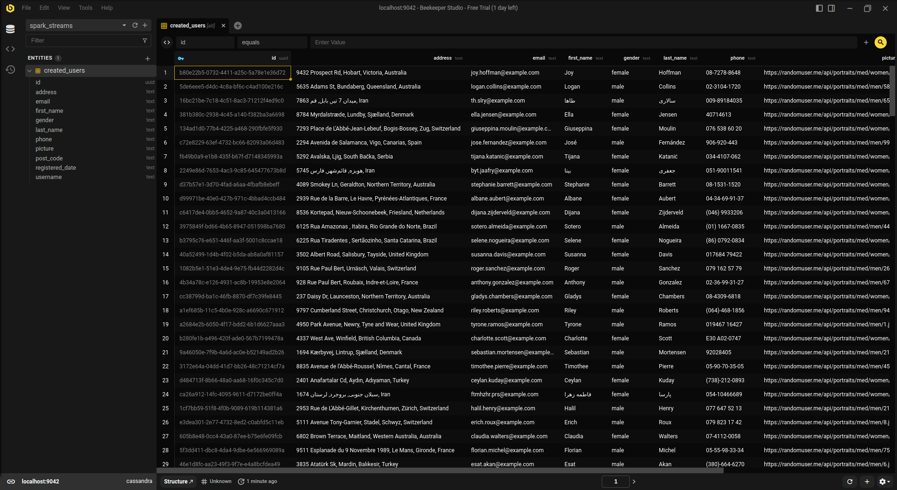
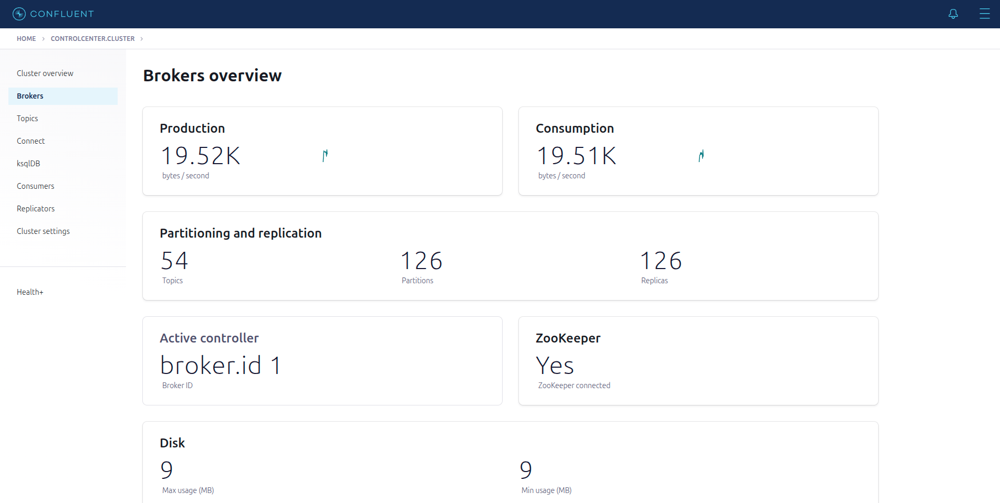
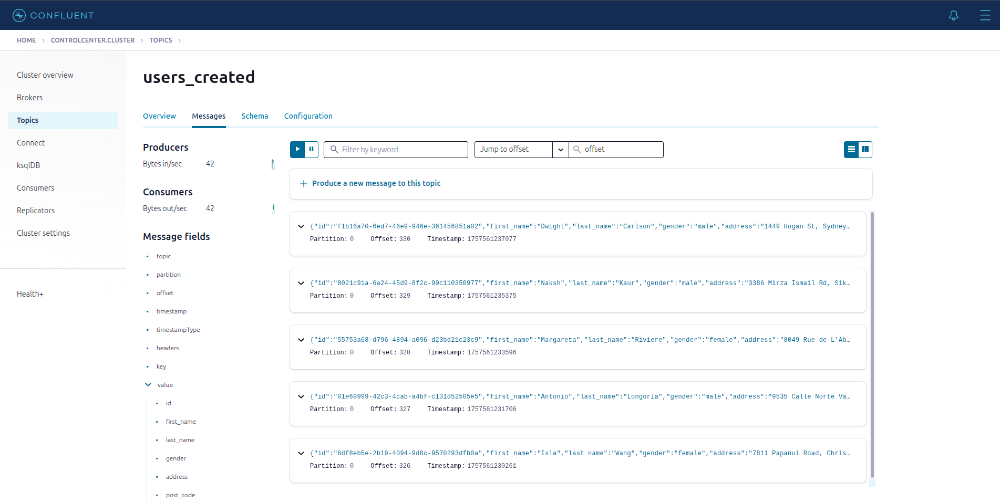
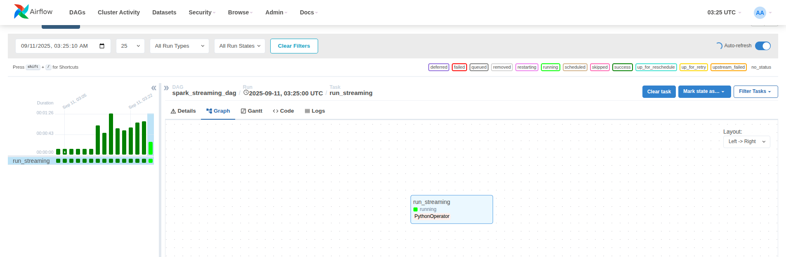

# 📡 Streaming Data Engineering Project

> Real-time data engineering project using Docker, Kafka, Spark Structured Streaming, Cassandra and Airflow

## 🧾 Project Overview

This project demonstrates a real-time data pipeline for streaming ingestion, processing, and storage.
It covers orchestration (Airflow), streaming processing (Spark Structured Streaming), real-time messaging (Kafka), scalable storage (Cassandra), and analytics (Jupyter).

## ⚙️ Architecture Diagram


## 💡 Technology Stack

**Programming Languages :**
- Python
- SQL

**Data Streaming & Orchestration :**
- Apache Kafka
- Apache Airflow
- Apache Spark (Structured Streaming)

**Infrastructure & Storage  :**
- Docker
- Cassandra

**Visualization :**
- Looker Studio
- JupyterLab

## 🐳 Docker / Infrastructure Setup


**Services included :**
- `zookeeper`, `broker`, `schema-registry`, `control-center`
- `airflow-webserver`, `airflow-scheduler`, `postgres`
- `spark-master`, `spark-worker`
- `cassandra_db`
- `jupyter`
- `producer` *(running inside container)*

## 💾 Real-time Storage (Cassandra)



**Key Features :**
- Uses **Cassandra** for scalable, fault-tolerant storage.
- Processed streaming data from Spark is written into Cassandra.
- Supports CQL queries for downstream analytics.

## ⚡ Spark Cluster (Master/Workers)


**This cluster runs in standalone mode with :**
- 1 Spark Master
- 1 Spark Workers
- Deployed inside Docker containers

## 📂 Data Ingestion

### 1. Kafka Producer
```json
{
  "id": "8e7fce72-89bc-4685-a747-b0f8624e020d",
  "first_name": "Elaine",
  "last_name": "Harvey",
  "gender": "female",
  "address": "353 Blossom Hill Rd, Dayton, Vermont, United States",
  "post_code": 18511,
  "email": "elaine.harvey@example.com",
  "username": "smallcat386",
  "dob": "1999-04-02T12:55:47.460Z",
  "registered_date": "2019-10-19T01:25:43.507Z",
  "phone": "(456) 390-1836",
  "picture": "https://randomuser.me/api/portraits/med/women/0.jpg"
}
```
- Custom producer generates real-time events.
- Data is published to Kafka topics, consumed by Spark.
- Producer runs inside container.
- Kafka Control Center available at http://localhost:9021.

### 2. Kafka Control Center Overview

**Kafka Brokers :**

  Shows the Kafka brokers managing the streaming data.


*Shows the active Kafka brokers handling the streaming data.*

**Kafka Topics :**
    
  Shows the active Kafka topics where events are published.


*Shows the Kafka topics where the real-time events are published.*

## 🧾 Data Flow Diagram


## 🔄 Streaming ETL Workflow Diagram


#### Spark ETL Components / Airflow Tasks

1. **Ingestion Stage:**
   - `kafka_producer` → send events into Kafka topics

2. **Transform & Load Stage:**
   - `run_streaming` task → reads Kafka streams using Spark Structured Streaming
   - Performs transformations, filtering, and parsing
   - Writes processed results into Cassandra tables

  
3. **Orchestration:**
   - Airflow DAG schedules and monitors the `run_streaming` task
   - DAG runs every 1 minute (`schedule_interval='*/1 * * * *'`)
   - Limits concurrency and active runs to avoid overlapping tasks

## ✅ Final Output
* The final output from Looker Studio can be accessed via the following link: [View Dashboard](https://lookerstudio.google.com/reporting/5737527d-e089-47f5-80f1-2adda4ff3019). Note: The dashboard reads data from a static CSV file exported from BigQuery.

## 🚀 Setup & Execution

1. Clone this repository :

```bash
git clone https://github.com/supakunz/Streaming-Data-Pipeline.git
```

2. Start the services :
```bash
docker compose up -d
```

3. Start the services :

- Airflow: http://localhost:8080
- Kafka Control Center: http://localhost:9021
- Jupyter: http://localhost:8888
- Cassandra (CQL): `localhost:9042`

## 🙋‍♂️ Contact

Developed by **Supakun Thata**  
📧 Email: supakunt.thata@gmail.com  
🔗 GitHub: [SupakunZ](https://github.com/SupakunZ)

